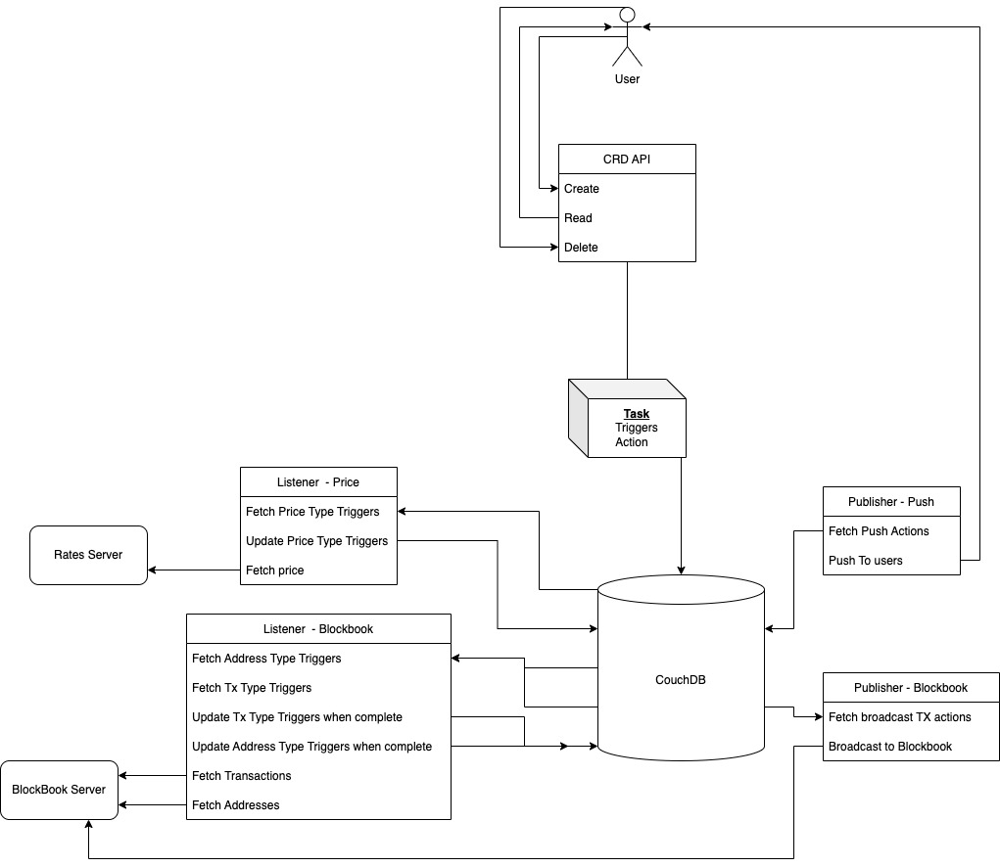

# Push Server Overview

## Introduction
The push server handles all the push notifications for end users.

The server itself consists of an API interface and a number of publishers/listeners. Below you can find documentation for the API inteface and specific publishers/listeners.

* [API](./api.md)
* [Push Publisher](./publishers/push-publisher.md)

## Architecture
The push server is constructed as a number of independent microservices: 

The core component of the server is the CouchDB database, with which publishers and listeners perform their operations based on the changes in the database.