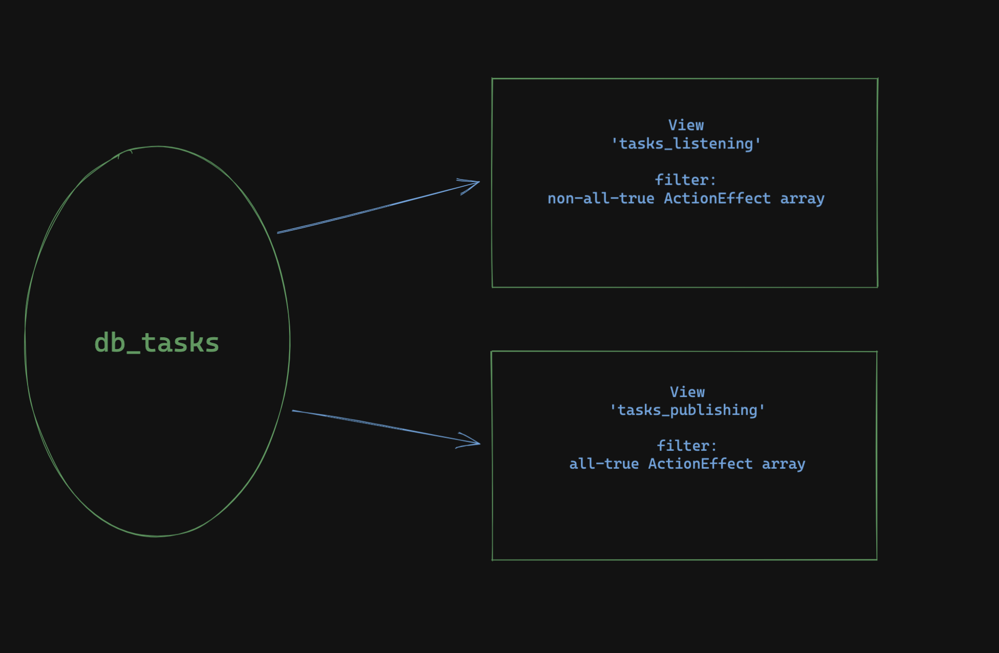
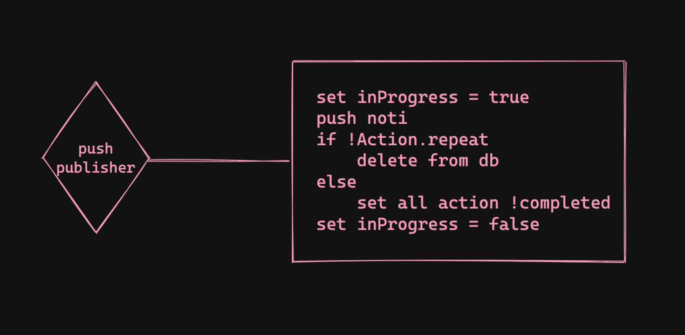

# Push Publisher
## Overview

The push publisher is responsible for pushing notifications to end users.

The new version of the push server is designed to accommodate the "action-queue" feature of the Edge app. Users will have the ability to configure an arbitrary number of transactional actions and to "chain" them all together with predefined sequences. 

Some servers will then process these actions. The push publisher's job, then, is to handle push notifications once tasks are done. 

## Architecture
The publisher directly interacts with a CouchDB database, named 'db_tasks'. However, for performance reasons, we create two "views" for the database. A view is simply an interface that displays a set of documents based on certain query conditions.

### Views 

Since the push publisher only pushes notifications for completed tasks, it is best to have a view that shows all completed tasks, and another view to show all incompleted tasks.



`Task` is a data type modeled as below:
```js
taskId: string
userId: string
actionEffects: ActionEffect[]
action: Action
```

The `task_publishing` view contains all `Task`s that have every `ActionEffect` marked as completed. This is the view that the push publisher is listening for changes.

Similarly, the `task_listening` view contains `Task`s that have at least one incomplete `ActionEffect`.

## Publisher Logics
The push publisher gets a stream of `Task` documents from the `task_publishing` view. For each eligible document, the publisher pushes a notfication to devices.



Depending on the `Action` of each task, the publisher may delete a task document if the `Action`'s `repeat` flag is marked as false. 

Otherwise, the publisher loops through the array of `ActionEffect`s, and set the `completed` flag to false for each one. Upon updating the document, the `task_listening` view will automatically pick up the `Task`, thereby allowing the `Task` to be processed repeatedly.

To prevent race conditions, the push publisher also manipulate the `inProgress` flag in the `Action` property.

The mutex implementaion coupled with the dual-view design abstractly reap the benefits of a message queue where each task can only be picked up by one service.
